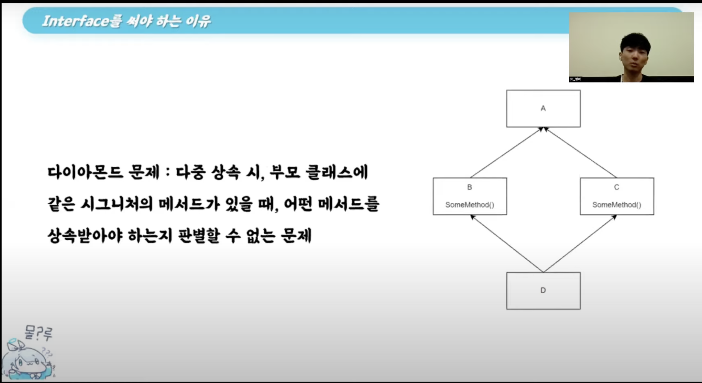
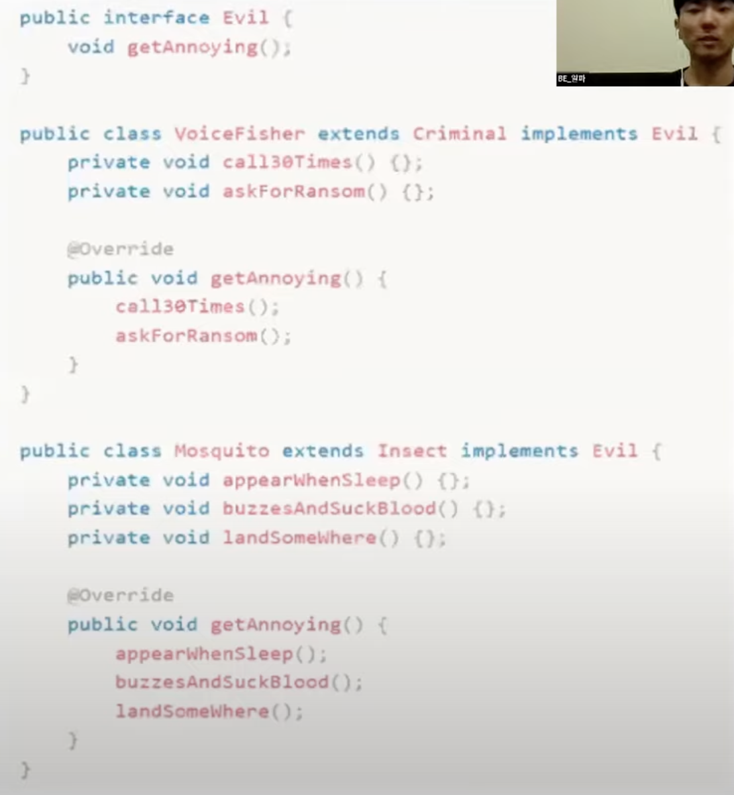
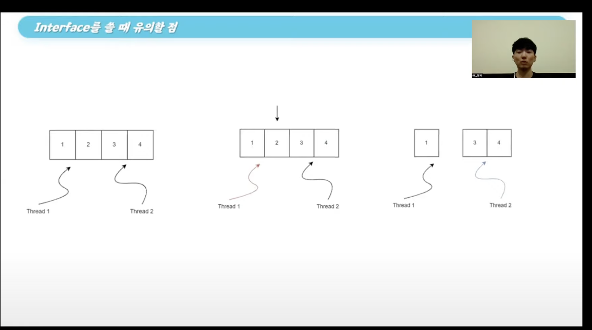

# Interface


### Interface의 특징

* 인스턴스를 생성할 수 없다.

* *** 추상 메서드 *** (body 부분이 없는 메서드)를 가질 수 있다.

* 상수를 가질 수 있다.

* 디폴트 메서드 / static 메서드를 가질 수 있다. (Jdk 8 이상)

  * 디폴트 메서드: 추상 메서드와 다르게 인터페이스에서 body를 가지는 메서드

    * override 필요 X

    * 접근 제어자는 public

    * 이미 존재하는 인터페이스에 기능 추가 (메서드 추가)를 하려하면 해당 인터페이스의 구현체 클래스들은 추가되는 메서드를 override 해야하는 소요가 발생한다.

    * 하지만 디폴트 메서드로 기능 추가를 하면 구현체 클래스들이 override를 안해도 컴파일 에러가 발생하지 않는 장점이 있다.

      

### 추상클래스 Vs 인터페이스

* 추상 클래스: 실체 클래스의 공통적인 부분들 (필드, 메서드)을 추출해서 규격을 잡아놓는 클래스 (*** 미완성 설계도 ***)
  * 여러 개의 클래스들이 있을 때, 공통되는 필드 또는 메서드들이 있다면 그것들을 추출해서 추상 클래스로 생성 후 실체 클래스에 상속
  * 사용 시점
    * 구현체 클래스들의 필드나 메서드들이 많이 겹칠 때
    * 밀접하게 관련된 클래스끼리 코드를 공유해야 할 때

```Java
public abstract class Keyboard {
  public abstract string pressKey();
}
```

* 인터페이스: 동일한 목적 하에 동일한 기능을 수행하도록 강제하는 역할

  * 개발자 언어로 바꾸면 자바의 다형성을 활용하여 코드의 목적 또는 방법이 바뀌었을 때 유지보수를 편하게 해주는 역할

  * 사용 시점

    * 관련 없는 클래스들끼리 관계를 맺어줄 때

    * 다중 상속이 필요할 때

    * 특정 데이터 타입의 동작(메서드)를 지정하려고 하지만 해당 동작을 누가 구현하는지는

      중요하지 않을 때

      ```Java
      @Service
      public interface ChallengeService {
      
        // 챌린지 만드는 메서드를 어떤 구현체 클래스가 쓰는지는 관심 없음
          public ChallengeDTO createChallenge(ChallengeRequest challengeRequest);
      
      }
      ```

      

```Java
public interface Keyboard {
  public string pressKey();
}
```


#### 인터페이스를 사용하는 이유

* *** 다중상속 *** 여부

  * 추상 클래스는 다중 상속이 불가능

  * 인터페이스는 다중 상속이 가능

    * 물론, 상속의 상속 개념을 이용하여 최종 구현 클래스까지 상속할 수 있지만 의도하지 않은 상속이 포함될 수 있기 때문에 꺼려지는 방법이다.

  * 영상에서는 속성이 n개가 있다면 2^n -1 개의 클래스가 필요하다고 한다.

  * *** 다이아몬드 문제 ***

    * 

    * 해당 문제는 A 클래스가 B, C의 클래스로부터 다중상속을 받을 때 시그니처가 같은 두 SomeMethod() 중 어떤 메서드를 상속 받을 것이냐

      에 대한 문제이다.

    * 하지만 B,C,D가 인터페이스라면 SomeMethod()는 추상 메서드로 Body 부가 빠져있기 때문에 구체화 되지 않고 어떤 SomeMethod()를 상속받는지에 상관 없이 A 자체에서 구현 하면서 구분 할 수 있다.

* 부모 클래스가 같지 않은 두 클래스에 대해 관계를 맺을 수 있다.

  * 
  * 보이스피싱 클래스와 모기 클래스는 각각 상속받는 부모 클래스가 다르다.
  * 하지만 같은 인터페이스를 상속 받으면서 getAnnoying() 메서드를 사용한다.

  

### Skeletal Implmentation

> 추상 클래스와 인터페이스 모두 사용하는 경우
>
> 추상 클래스와 인터페이스 둘 모두의 장점을 갖기 위해 사용
>
> Ex. Java의 AbstractMap, AbstractSet

```Java
public abstract class AbstractMap<K,V>
extends Object
implements Map<K,V>
```


* 같은 인터페이스를 상속 받는 두 구현체 클래스에서 구현 메서드가 공통 될 경우 

  공통되는 부분을 따로 추상 클래스로 구현함

  * 구현체 클래스에서 중복 되던 코드가 사라진다. => 코드량이 감소한다.
  * 어? 그럼 인터페이스의 디폴트 메서드로 공통되는 부분을 구현하면 되는거 아니냐?
    * 추상 클래스는 private, protected가 가능 But, 인터페이스는 접근 제어자가 모두 public => Override한 메서드의 내부 메서드들을 클라이언트로 부터 은닉하려면 추상 클래스를 사용
    * 인터페이스의 디폴트 메서드에서는 구현체 클래스의 필드에 대한 참조가 불가능


### 디폴트 메서드 Override

#### 예시

> Java의 Collection 인터페이스의 디폴트 메서드 removeIf의 사용




* 위 사진과 같이 멀티 스레드 환경에서 동작할 때는 Thread 1이 2번 원소를 삭제한 사실을 모르고 Thread 2는 계속 순회하다가

  런타임 에러를 터뜨릴 것이다.

  * 이를 해결하기 위해선 어떻게 해야 할까

* 디폴트 메서드인 removeIf를 Override해서 lock을 걸어주면 해결

  * ```Java
    @Override
    public boolean removeIf(final Predicate<? super E> filter) {
      sychronized(lock) {
        	return decorated().removeIf(filter);
      }
    }
    ```

  * 어? 근데 아까 인터페이스의 추상 메서드는 body 부분이 없어서 다이아몬드 문제가 일어나지 않았지만 body가 있는 디폴트 메서드를 Override하면 문제가 발생하지 않냐?

  * 이를 해결하기 위해 컴파일러는 디폴트 메서드 Override 시 우선순위 규칙을 도입한다.

    * 1순위: 구현 클래스나 슈퍼클래스(부모 클래스) => 인터페이스를 상속하고 디폴트 메서드를 호출한 클래스의 부모 클래스의 메서드를 받거나 인터페이스의 구현 클래스의 메서드를 받음
    * 2순위: 상속받는 인터페이스: 디폴트 메서드가 있는 인터페이스를 상속받은 인터페이스의 메서드를 받음
    * 3순위: 명시적 사용: 프언에서 배운 이름한정과 동일


