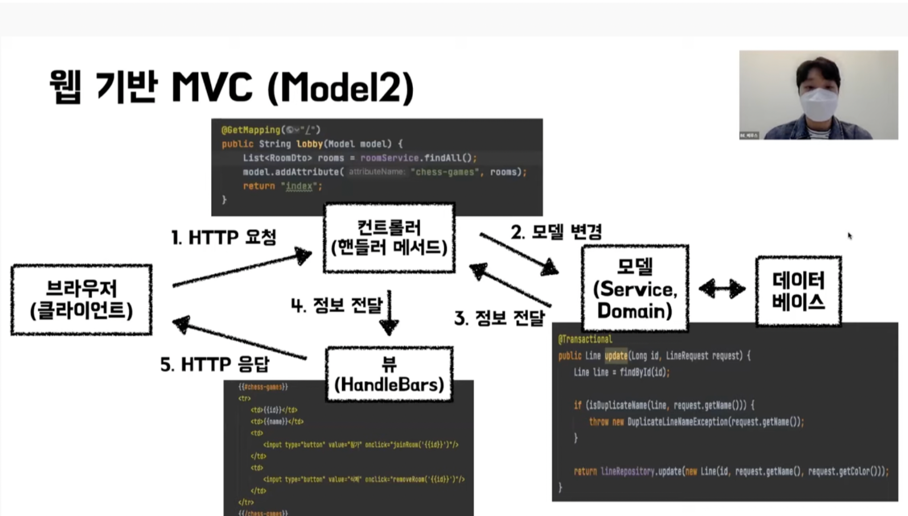
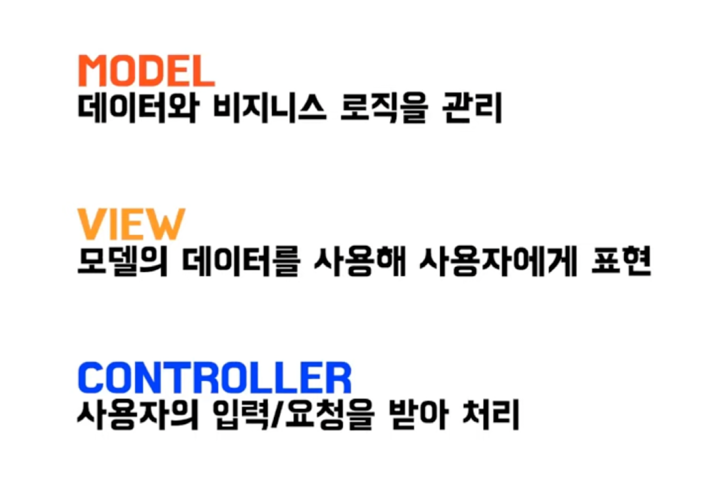

# MVC란?

### M : Model
### V : View
### C : Controller

## 1. Model
* 데이터와 비지니스 로직을 관리
* 뷰, 컨트롤러에 대한 의존성 X

## 2. View
* 모델의 데이터를 사용해 **시각적인 화면**을 구성하는 역할
* MVC 정의에 따라 모델과 의존성을 가질 수도, 없을 수도 있음

## 3. Controller
* 사용자의 입력을 받아 처리하는 역할
* 모델을 변경하고 뷰를 갱신

## 4. 전체적인 MVC 흐름

## 5. 가장 중요한 것만 정리

## 6. MVC의 핵심 개념?
> ### 뷰를 모델에서 분리하는 것!

### 1. 뷰와 모델은 기본적으로 서로 다른 관심사
* 뷰 : 사용자 인터페이스를 주로 고려
* 모델 : 비즈니스 정책이나 데이터 베이스 상호 작용 등을 고려

### 2. 모델의 재사용
* 동일한 모델로 다양한 뷰(콘솔, 웹 등)에 적용 가능

### 3. 테스트의 용이성
* 시각적인 요소를 배제하고 도메인 로직에 대한 테스트만 작성 가능