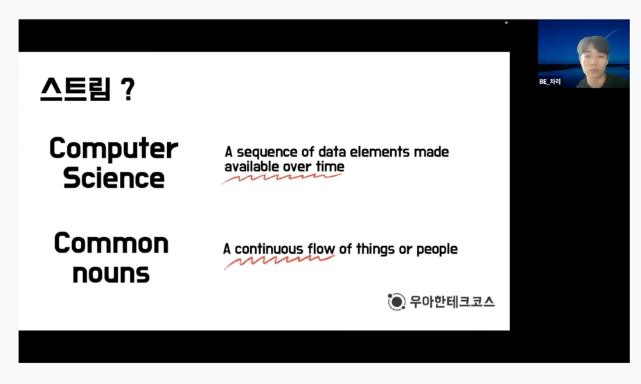
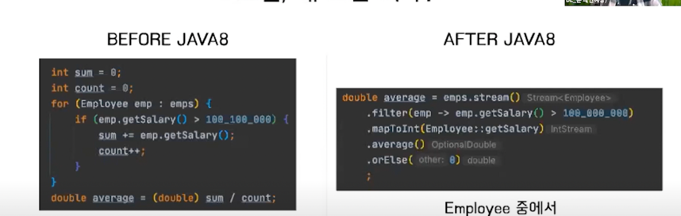
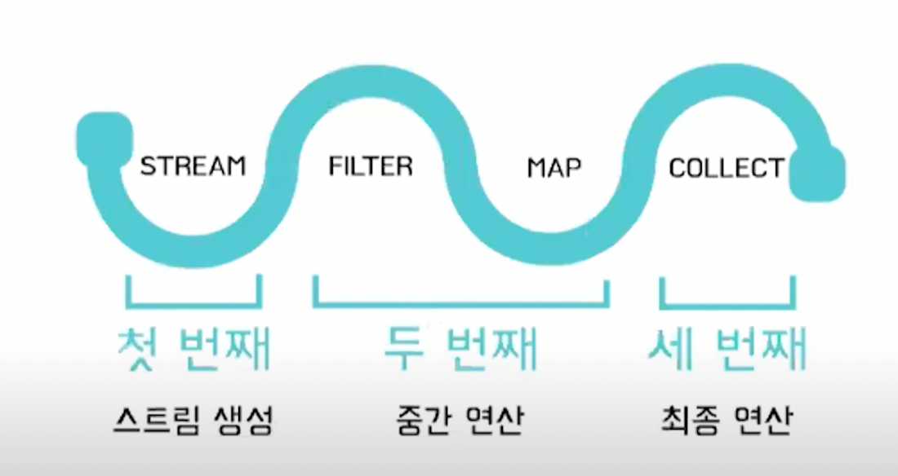

# Stream 이란?

🙆🏻‍♀️ 목차 : 정의, 특징, 사용법, 예시, 장단점

---



## 💡 1. 정의

### 정의1 : 데이터 처리 연산을 지원하도록 소스에서 추출된 **연속**된 값 요소

### 정의2 : 컬렉션의 요소를 하나씩 참조해 람다시으로 처리할 수 있는 반복자

### 요약 : 데이터 컬렉션 반복을 멋지게 처리하는 기능

### 자바의 스트림 API : 이 데이터 컬렉션을 어떻게 다룰 것인가를 논하는 일종의 "파이프라인"


## 💡 2. 특징



* 스트림 이전 : 스트림을 쓰기 전에는 **how** 중심의 외부반복을 이용함
* 스트림 이후 : **what** 중심의 내부 반복을 쓰게 되면서 **"직관적인"** 코드를 짤 수 있게됨


```
// 빨간색 사과 필터링
List<Apple> redApples = forEach(appleList, (Apple apple) -> apple.getColor().equals("RED"));

// 무게 순서대로 정렬
redApples.sort(Comparator.comparing(Apple::getWeight));

// 사과 고유번호 출력
List<Integer> redHeavyAppleUid = new ArrayList<>();
for (Apple apple : redApples)
    redHeavyAppleUid.add(apple.getUidNum());
```


```
List<Integer> redHeavyAppleUid = appleList.stream()
        .filter(apple -> apple.getColor().equals("RED"))        // 빨간색 사과 필터링
        .sorted(Comparator.comparing(Apple::getWeight))         // 무게 순서대로 정렬
        .map(Apple::getUidNum).collect(Collectors.toList());    // 사과 고유번호 출력
```

---


> 자료구조가 포함하는 모든 값을 메소드에 포함하는 컬렉션과 다르게,   
> 스트림은 **"요청할 때만"** 요소를 계산하는 고정된 자료구조를 가진다.

> 적극적 생성 : 모든 값을 "다" 처리하고 넘겨줌   

> **게으른 생성 : 요청할 때마다 값을 처리하고 넘겨줌** 


--> 여러 개의 조건이 중첩된 상황에서 값이 결정나면,   
    불필요한 연산을 진행하지 않고 조건문을 빠져나와 실행 속도를 높인다.


### ✅ 추가 > 컬렉션 vs. 스트림


> 데이터를 계산하는 시기

컬렉션은 현재 자료구조가 포함하는 모든 값을 메모리에 저장하는 자료구조다.   
즉, 컬렉션의 모든 요소는 컬렉션에 추가하기 전에 계산되어야 한다.   
스트림은 요청할 때만 요소를 계산하는 고정된 자료구조다.   
스트림에 요소를 추가하거나 제거할 수 없다.   
즉, 사용자가 데이터를 요청할 때만 값을 계산한다.   

> 반복 탐색

컬렉션은 미리 계산되어진 값을 메모리에 갖고 있기 때문에 여러번 탐색이 가능하다   
반면 스트림은 반복자처럼 한 번만 탐색할 수 있다. 즉, 탐색된 스트림의 요소는 소비된다.   

> 데이터 반복 처리 방법

컬렉션을 사용하려면 사용자가 직접 요소를 반복해야한다. 이를 외부 반복이라 한다.   
스트림은 반복을 알아서 처리하고 결과 스트림값을 어딘가 저장해주는 내부 반복을 사용한다.   


## 💡 3. 사용법

### 구성



* 첫 번째 : 컬렉션을 스트림으로 만들어주는 연산자 (즉, 스트림 생성)
* 두 번째 : 데이터를 처리하는 중간 연산자
* 세 번째 : 연산을 정리하고 결과를 도출하는 최종 연산자


```
list.stream() //스트림 만들기   
    .distinct() //중간연산   
    .limit(5) //중간연산
    .sorted() //중간연산
    .forEach(System.out::println) //최종연산
```


## 💡 4. 예시


```
@Data
public class SampleDto {
    private int idx;
    private String name;
    private String gender;
}
```

* 스트림 기본

```
/**
 * 기존 Java7 코드와 Java8 코드를 비교해보자.
 */
public class BasicStream {
    public static void main(String[] args) {
        java7Code();
        java8Code();
    }
 
    /**
     * java7
     */
    static void java7Code() {
        /* java7 */
        List<SampleDto> list = new ArrayList<>();
        List<SampleDto> sampleDtoList = new ArrayList<>();
 
        for (SampleDto sampleDto : sampleDtoList) {
            if (sampleDto.getIdx() < 10) {
                list.add(sampleDto);
            }
        }
 
        /* 익명클래스 */
        Collections.sort(list, new Comparator<SampleDto>() {
            @Override
            public int compare(SampleDto o1, SampleDto o2) {
                return Integer.compare(o1.getIdx(), o2.getIdx());
            }
        });
 
        /* 정렬된 리스트 중 sampleDto의 getName 셋팅 */
        List<String> stringList = new ArrayList<>();
        for (SampleDto sampleDto : list) {
            stringList.add(sampleDto.getName());
        }
    }
 
    /**
     * java8
     */
    static void java8Code() {
        /* java8 */
        List<SampleDto> sampleDtoList = new ArrayList<>();
 
        List<String> list = sampleDtoList.stream()
                /** 람다를 인수로 받아, 스트림에서 특정 요소를 제외시킨다. 아래는 idx가 10 이상인 데이터를 선택한다. */
                .filter(d -> d.getIdx() < 10) // idx가 10보다 작은 데이터 선택
                .sorted(Comparator.comparing(SampleDto::getIdx)) // idx 순서로 정렬
                /** 람다를 이용해서 한 요소를 다른 요소로 변환하거나 정보를 추출한다. */
                .map(SampleDto::getName) // 이름 추출
                //.limit(3) // 선착순 3개만 선택
                .collect(Collectors.toList()); // 리스트로 저장
 
        /* 병렬 */
        List<String> parallelList = sampleDtoList.parallelStream()
                            .filter(d -> d.getIdx() < 10) // idx가 10보다 작은 데이터 선택
                            .sorted(Comparator.comparing(SampleDto::getIdx)) // idx 순서로 정렬
                            .map(SampleDto::getName) // 이름 추출
                            .collect(Collectors.toList()); // 리스트로 저장
    }
 
    /**
     * 스트림은 단 한번만 소비 가능하다.
     */
    static void impossibleNewStream() {
        List<String> title = Arrays.asList("A", "B", "C");
        Stream<String> s = title.stream();
 
        s.forEach(System.out::println); // A, B, C 출력
        /** java.lang.IllegalStateException:스트림이 이미 소비되었거나 닫힘 에러 발생 */
        s.forEach(System.out::println);
    }
}
```


* stream filter

```
public class StreamFilter {
    public static void main(String[] args) {
 
    }
 
    /**
     * 중복 필터링
     */
    static void distinct() {
        /* 내부반복 */
        List<Integer> numbers = Arrays.asList(1, 2, 1, 3, 3, 2, 4);
 
        numbers.stream()
                .filter(i -> i % 2 == 0)
                .distinct() /* 중복 필터링 */
                .forEach(System.out::println);
    }
}
```


* stream 외부반복/내부반복

```
/**
 * 외부반복/내부반복
 외부반복 : 사용자가 직접 요소를 반복 (for-each 등)
 내부반복 : 스트림 라이브러리 -반복을 알아서 처리하고 결과 스트림값을 어딘가에 저장해준다
 */
public class StreamIteration {
    public static void main(String[] args) {
        forEachCode();
    }
 
    /**
     * 내부반복/외부반복 예제
     */
    static void forEachCode() {
        /* 내부반복 */
        List<String> names = new ArrayList<>();
        List<SampleDto> sampleDtoList = new ArrayList<>();
 
        for (SampleDto sampleDto : sampleDtoList) {
            names.add(sampleDto.getName());
        }
 
        /* 외부반복 */
        List<String> streamNames =  sampleDtoList.stream()
                                        .map(SampleDto::getName)
                                        .collect(Collectors.toList());
    }
}
```


## 💡 5. 장단점

> ### 장점
> * 가독성이 좋다
> * 코드 변경이 쉽다 (유연성이 높다)
> * 병렬처리를 간단하게 해결할 수 있다 (-> 성능 높아짐)

> ### 단점
> * 생성하는 데에 적지 않은 비용이 발생한다