# 🐈‍⬛ Merge, Rebase, Cherry-pick

## 1️⃣ Merge란?
* git은 서로 다른 작업을 하기 위한 별도의 공간을 생성할 때 브랜치를 생성할 수 있다.
* 기능 구현을 위해서 해당하는 기능을 구현하기 위한 브랜치를 생성한다.
* 기능 구현이 되는 경우 해당 기능을 main 브랜치에 merge한다.


예시)

alternate 브랜치를 만들고, 새 파일들을 추가한 후 저장소에 추가하고 커밋한다.   

현재 alternate 브랜치에 커밋한 내용은 master 브랜치에 존재하지 않는다.      
이제 ```git merge``` 명령어를 사용하여 두 브랜치를 합칠 수 있다.   

먼저 현재 브랜치를 합치고자 하는 대상 브랜치로 전환해야 한다.   
그 다음 ```git merge```를 실행하여 현재 브랜치에 합치려는 브랜치명을 지정하면 된다.


```
git checkout master
git merge alternate
```

이제 alternate 브랜치의 변경 사항이 master 브랜치에 합쳐졌다.

* 기능 브랜치(b-oriori)를 main에 merge하는 예시
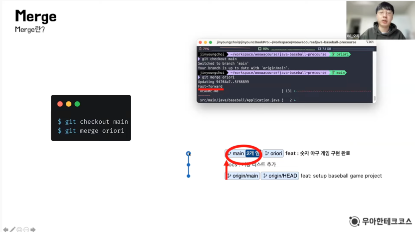

추가설명> 제일 아래 commit인 setup commit을 가리키고 있던 main 브랜치가   
기능 브랜치가 가리키고 있던 commit으로 올라옴 (=>Fast-forward 방법)   

✅Fast-forward: 가리키고 있던 commit을 merge할 브랜치의 commit으로 이동하는 것 (Merge 방법 중 가장 기본적인 방법)

---

### ✅ 3-way-merge

기존 main에 있던 테스트가 변경되어서   
해당 테스트 코드를 변경하고 테스트를 진행해야 하는 상황   
-> upstream/main 브랜치의 변경점을 반영해야 하는 상황

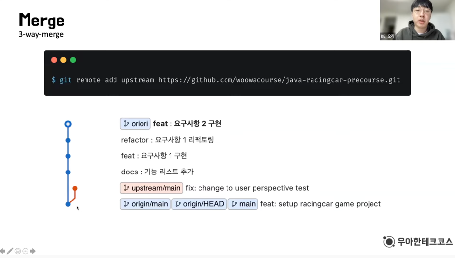

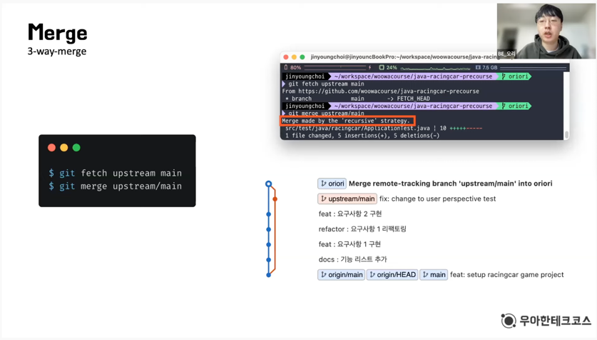

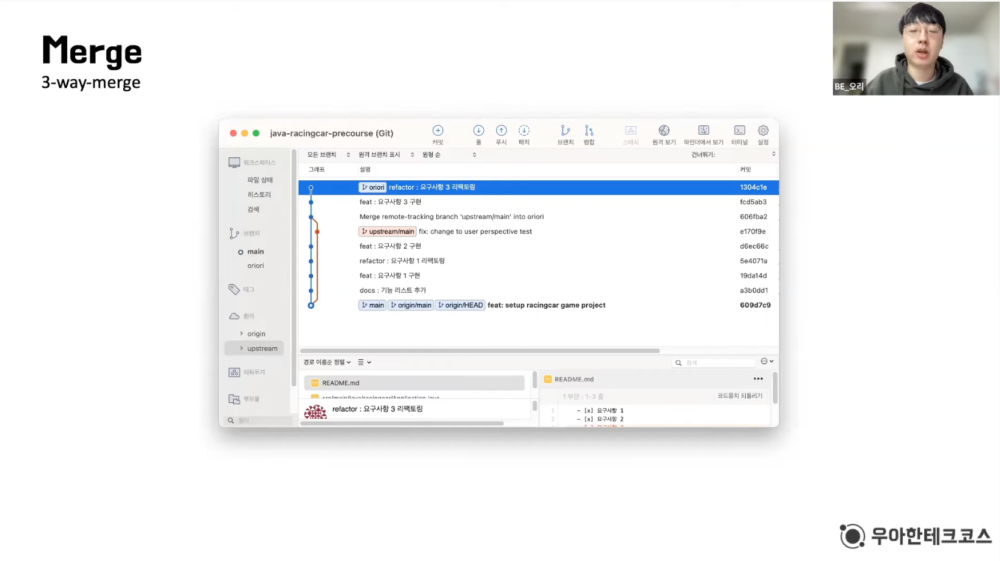

---

### 깃허브의 pull request에서 제공하는 세 가지 merge 방법

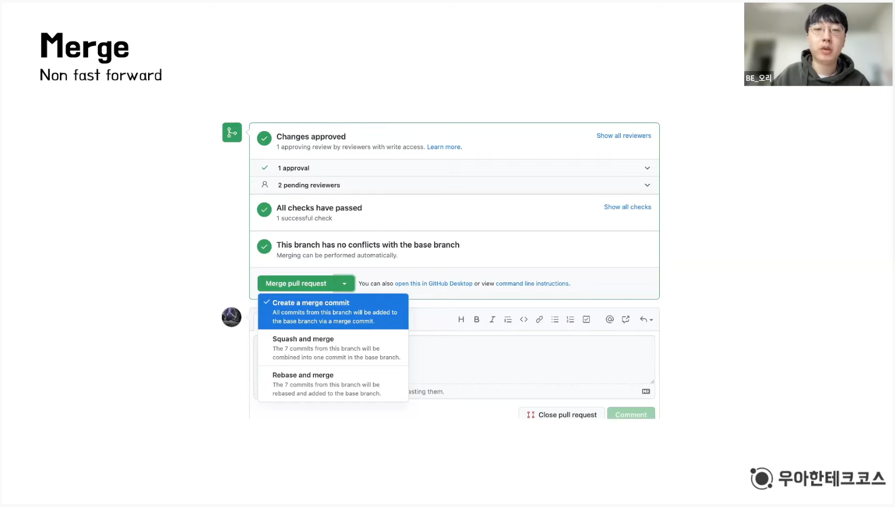

* 1 : Create merge commit
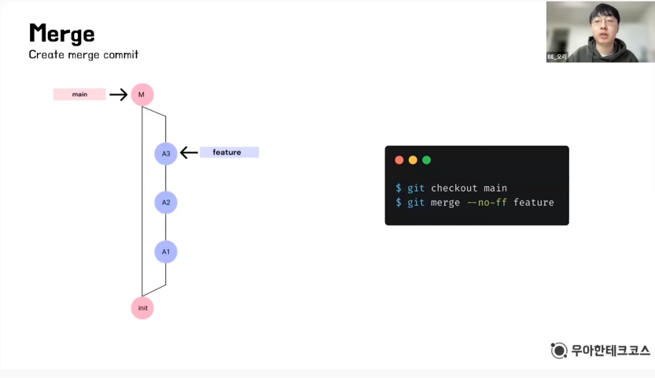   

-> 베이스 브랜치가 같더라도 fast-forward를 진행하는 것이 아니라,   
하나의 merge commit을 생성해서 merge를 진행하는 방법   
(장점: 기능 구현을 할 때 사용했던 commit들이 하나하나 다 살아 있어   
이를 사용할 여지를 남김과 동시에 만든 기능에 대해서 merge분기점이 생기므로,    
어떤 기능을 만들어 merge를 했는지 가독성이 좋아진다.)   


* 2 : Squash and merge
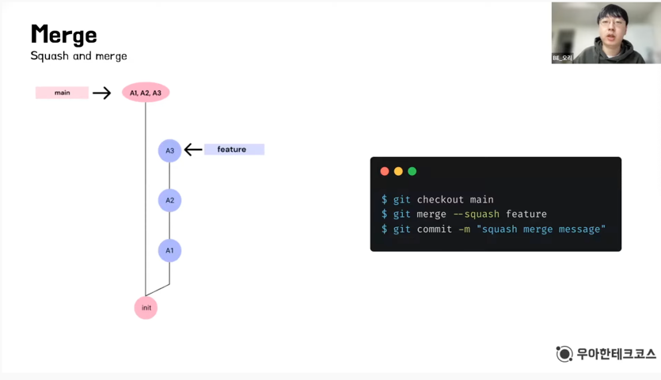
-> 하나의 merge commit을 생성해서 해당 commit을 바라보게 하는데   
feature에서 작업했던 모든 commit들을 하나의 commit으로 통합해서 merge하는 방법   
(장점: 특정 기능에 대한 하나의 commit만 두면서 가독성이 높아질 수 있다.)


* 3 : Rebase and merge
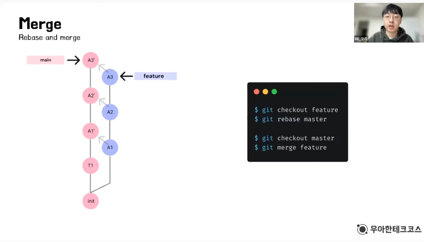
-> feature에서 작업했던 모든 commit들을 모두 현재 main 브랜치에서 최상단에 복사하고 붙여넣는 방법    


### 💡 요약

#### 1. Merge할 때 base가 같으면 Fast-forward한다.
#### 2. Merge할 때 base가 다르면 merge commit을 생성해서 auto merge한다.
#### 3. Github Pull Request에서 merge할 수 있는 방법에는 3가지가 있다.


---

## 2️⃣ Rebase란?

* Merge와의 공통점? -> 브랜치를 합친다!
* Merge와의 차이점? -> Merge보다 깨끗한 commit history를 만든다!

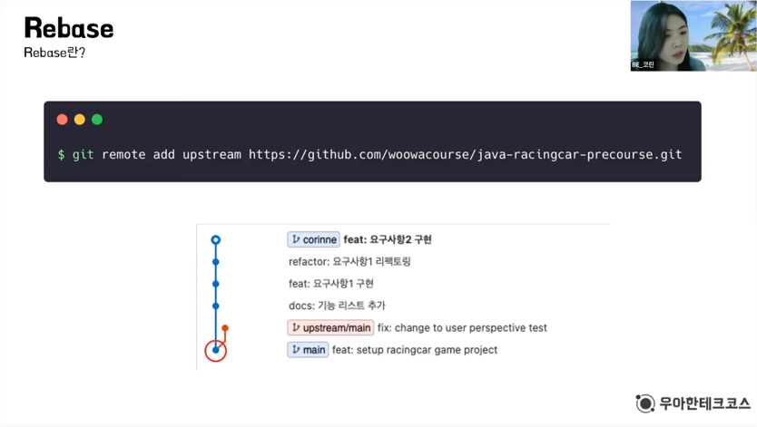

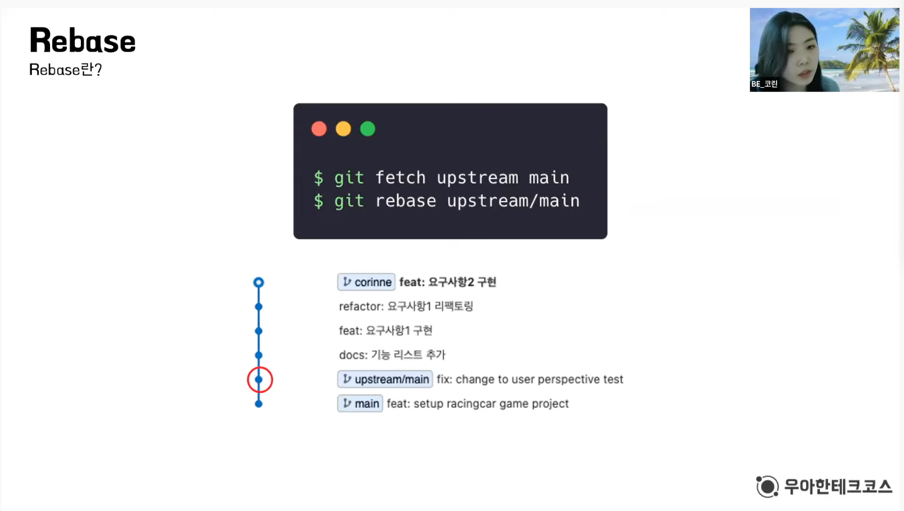

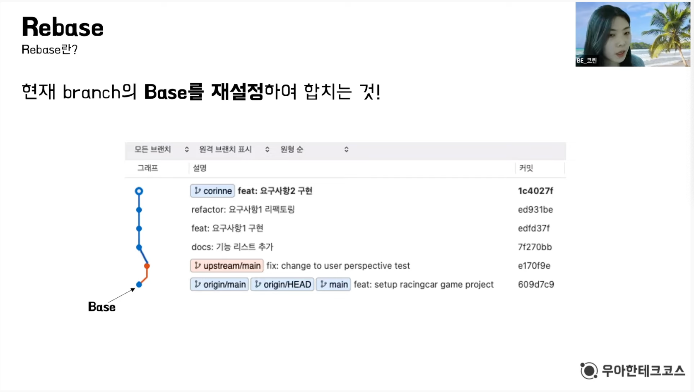

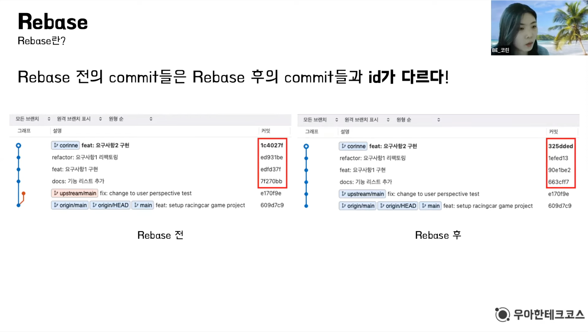


### 💡 요약
> #### 1. Rebase는 브랜치를 합치려는 목적으로 사용된다   
> (Commit History가 Merge와는 다르게 선형적으로 그려진다)
> 
> #### 2. Rebase는 현재 브랜치의 base를 바꾸겠다는 것이다
> (생성된 커밋들은 새롭게 복사되어 base가 변경된다)
> 
> #### 3. Merge를 한 코드 결과, Rebase를 한 코드 결과는 같아야 한다.


---


## 3️⃣ Cherry-pick란?

> ### "다른 브랜치에 있는 커밋을 **선택적**으로 내 브랜치에 적용시키는 것"

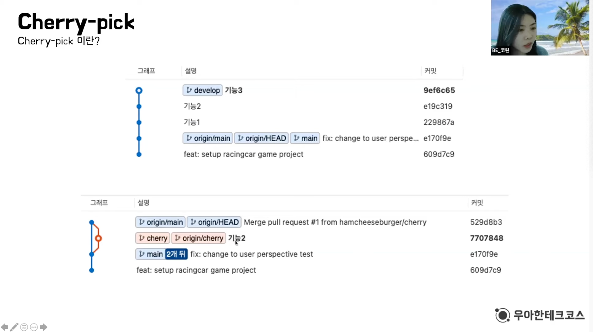

* 방법 1

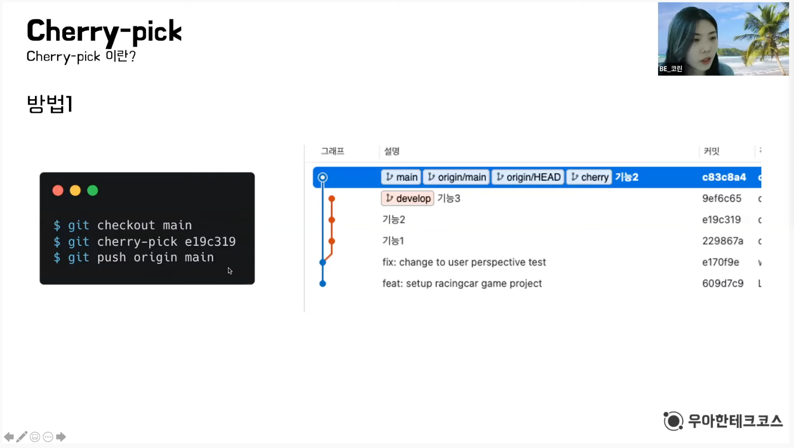


* 방법 2 -> 안전성을 위해 방법 2를 더 이용함

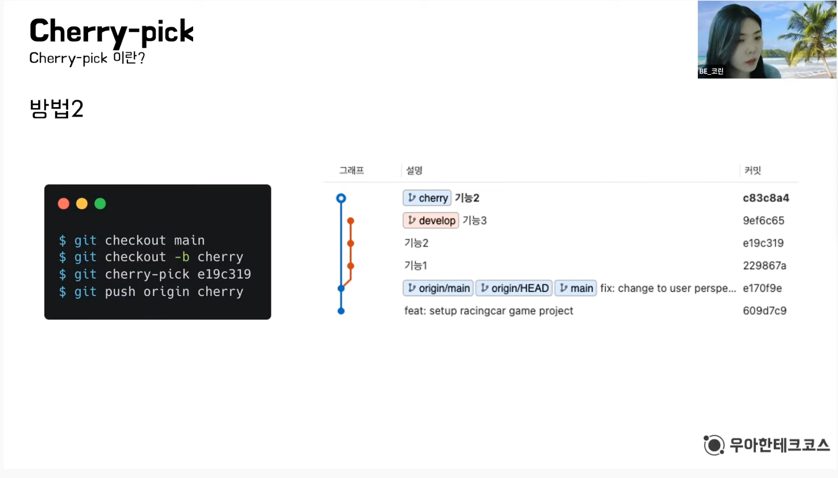

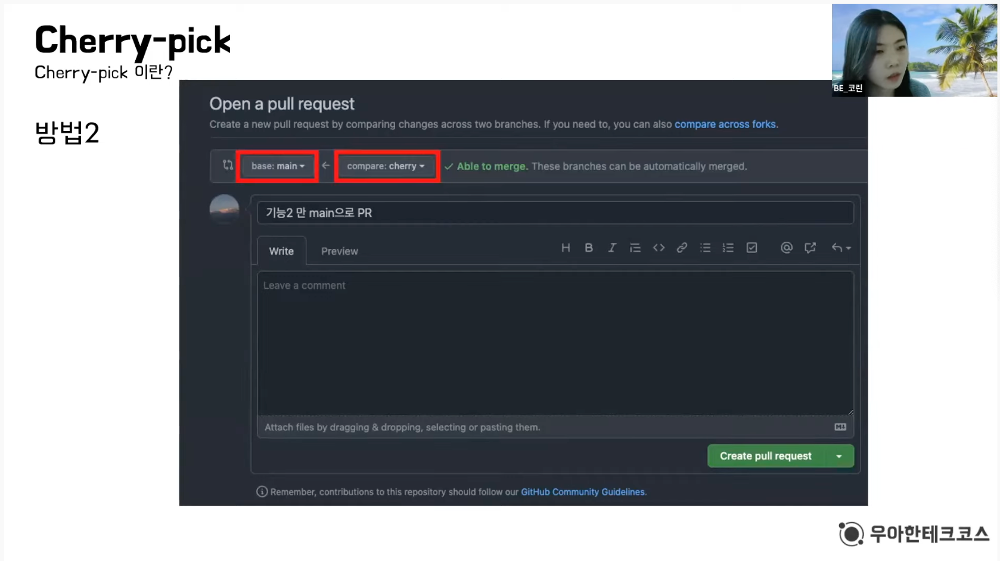

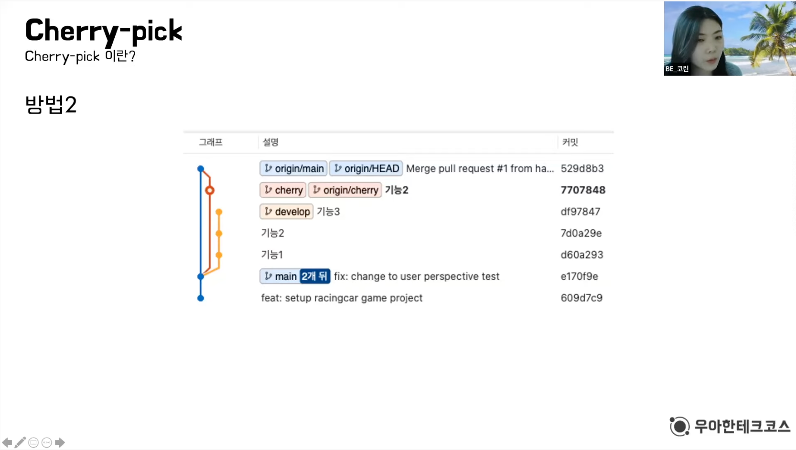