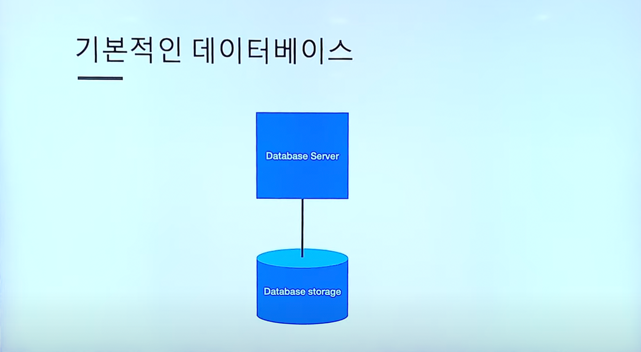
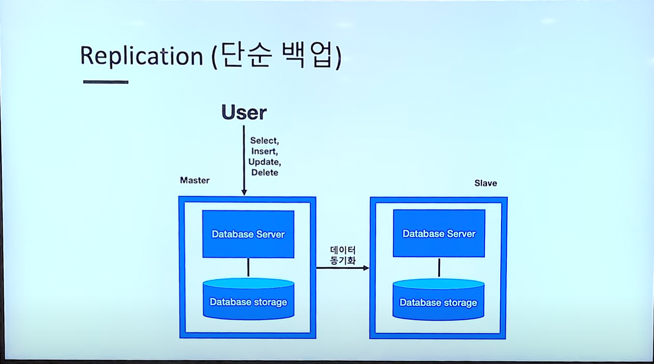
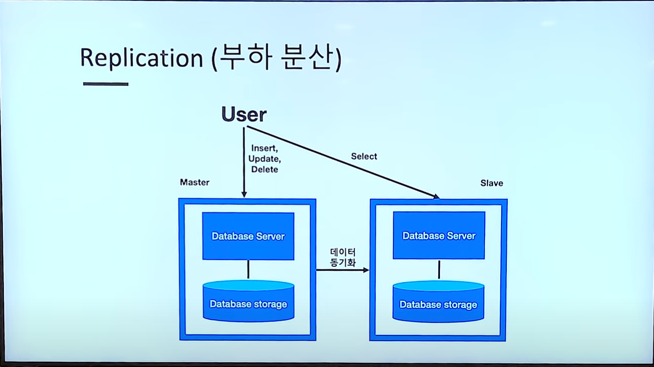
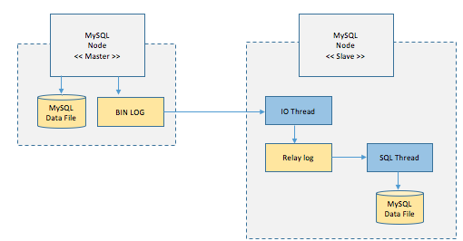
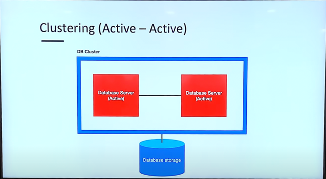
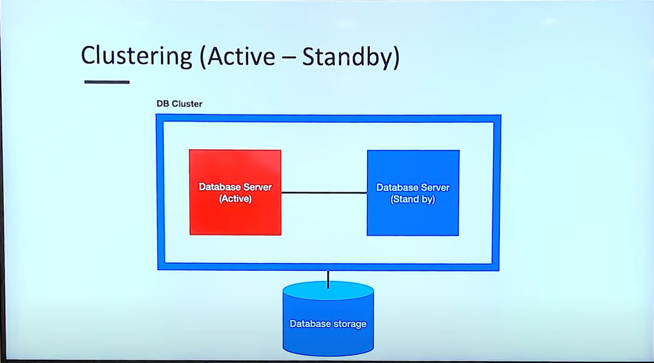

## 가장 기본적인 데이터베이스

#1. 리플리케이션(Replication)이란?

나오게 된 배경 : 저장된 데이터가 손실되면 어떻게 하지?   
 -> 실제 데이터가 저장되는 저장소도 복제하자! (실제 저장소까지 복제하는 방법)   

> 리플리케이션(Replication)이란?

**데이터베이스 리플리케이션(Replication)이란 말 그대로 복제본 데이터베이스를 운용하는 것이다.**   
원본 데이터베이스를 Master, 복제된 데이터베이스를 Slave라고 부른다.     
Slave 데이터베이스는 Master 데이터베이스를 복제(Replication)하여 동일한 데이터를 가지게 된다.

> 리플리케이션(Replication)의 장점과 단점

### 장점
* DB 요청의 60~80% 정도가 읽기 작업이기 때문에 Replication만으로도 충분히 성능을 높일 수 있다.   
* 비동기 방식으로 운영되어 지연 시간이 거의 없다.   

### 단점

* 노드들 간의 데이터 동기화가 보장되지 않아 일관성있는 데이터를 얻지 못할 수 있다.   
* Master 노드가 다운되면 복구 및 대처가 까다롭다.   

> 리플리케이션(Replication) 처리 방식

위의 그림은 MySQL의 Replication 방식에 대한 그림이며 자세한 처리 순서는 아래와 같다.

1️⃣ Master 노드에 쓰기 트랜잭션이 수행된다.   
2️⃣ Master 노드는 데이터를 저장하고 트랜잭션에 대한 로그를 파일에 기록한다.(BIN LOG)
3️⃣ Slave 노드의 IO Thread는 Master 노드의 로그 파일(BIN LOG)를 파일(Replay Log)에 복사한다.   
4️⃣ Slave 노드의 SQL Thread는 파일(Replay Log)를 한 줄씩 읽으며 데이터를 저장한다.   

리플리케이션은 Master와 Slave간의 데이터 무결성 검사(데이터가 일치하는지)를 하지 않는 비동기방식으로 데이터를 동기화한다.   

---

# 2. 클러스터링(Clustering)이란?

나오게 된 배경 : 데이터베이스 서버가 죽으면 어떡하지?   
 -> 데이터베이스 서버를 여러 개로 만들자!

> 클러스터링(Clustering)이란?

**클러스터링은 동일한 데이터베이스를 여러 대의 서버가 관리하도록 클러스터를 구축하는 것을 뜻한다.**    
이러한 클러스터링은 Active-Active 방식과 Active-StandBy 방식이 있다.

> 클러스터링(Clustering) 종류   

### 1. Active - Active

### 2. Active - Standby

 

> 클러스터링(Clustering) 장점과 단점

### 장점

* 노드들 간의 데이터를 동기화하여 항상 일관성있는 데이터를 얻을 수 있다.   
* 1개의 노드가 죽어도 다른 노드가 살아 있어 시스템을 계속 장애없이 운영할 수 있다.   

### 단점

* 여러 노드들 간의 데이터를 동기화하는 시간이 필요하므로 Replication에 비해 쓰기 성능이 떨어진다.   
* 장애가 전파된 경우 처리가 까다로우며, 데이터 동기화에 의해 스케일링에 한계가 있다.
* 비용

### 마무리
**💡데이터베이스를 나누는 것도 다 비용이기 때문에, 상황에 맞는 기술을 사용할 것💡**