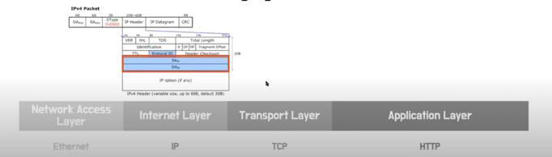
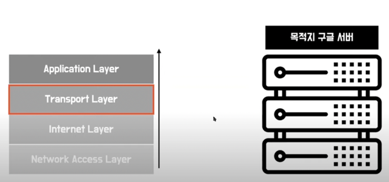

#1. 패킷교환방식이란(Packet Switching)?

패킷교환 방식은 기존에 전화에서 사용했던 회선교환 방식의 단점을 보완한 방식으로   
**패킷이라는 단위로 데이터를 잘게 나누어 전송하는 방식**   

* 소포를 보내듯 각 패킷에는 출발지와 목적지 정보가 있고 이에 따라 패킷이 목적지를 향해 가장 효율적인 방식으로 이동할 수 있음   
* 이를 이용하면 특정 회선이 전용선으로 할당되지 않기 때문에 빠르고 효율적으로 데이터를 전송할 수 있음   
> 💡정리: 인터넷 프로토콜(IP)는 출발지와 목적지의 정보를 IP 주소라는 특정한 숫자값으로 표기하고,   
>   패킷단위로 데이터를 전송하게 된다

* 왜 Circuit Switching이 아닌 Packet Switching인지?   
-> 이용 효율성이 떨어지고, 지정된 사용자만 해당 네트워크를 이용할 수 있으므로 효율성 측면을 고려했을 때에 Packet Switching을 선택하게 됨.   

#2. OSI 주요 계층 정리

* IP 주소: 목적지 host의 network interface까지 접근 가능   
* PORT 번호: 여러 process들 중 특정 process까지 접근 가능   

#3. www.google.com을 웹 브라우저에 입력하면 일어나는 과정 정리

🚀 패킷 만들기

* 해당 패킷 만들기 (각 계층에 필요한 정보를 담음)
* 패킷의 "캡슐화"가 진행됨 (Layer 5 -> 4 -> 3 -> .. 순서로 진행)

* Application Layer: HTTP Request 가 들어감

* Transport Layer
* 주요 부분 : 포트번호를 기입하는 부분인 SP와 DP

* SP(시작 포트번호): 내 컴퓨터의 포트 번호
* DP(목적지 포트번호): 웹서버의 80포트

* Network Layer

* SA(시작 IP주소): 나의 IP 주소
* DA(목적지 IP주소): 구글의 IP 주소
💡이때, **DNS프로토콜**을 통해서 도메인 정보로 IP주소를 알아낼 수 있음

* Network Access Layer
* 물리적으로 연결 된 현재 내 공유기의 MAC 주소가 필요!
* "공유기"를 통해서 다른 네트워크와 연결이 가능 -> "게이트웨이" 라고도 부름!

### ⭐️추가: 사설IP, 공인IP

* IPv4 주소: 현재 PC에 할당된 IP주소
* 게이트웨이 주소: 외부와 통신할 때 사용하는 네트워크 주소

* NAT (Network Address Translation)

---

패킷을 만든 후,   
TCP프로토콜은 "연결지향형 프로토콜"이기 때문에   
데이터를 전송하기 전에   
🚀**송신측과 수신측이 서로 "연결"되는 작업**이 필요하다   
#### ->  3-Way-Handshaking

* 3-Way-Handshaking에서는 TCP패킷의 SYN과 ACK 플래그가 이용됨   

### ✔️3-Way-Handshaking
> TCP/IP프로토콜을 이용해서 통신을 하는 응용프로그램이 데이터를 전송하기 전에   
> 먼저 정확한 전송을 보장하기 위해 **상대방 컴퓨터와 사전에 세션을 수립**하는 과정을 의미

⭐️ TCP 접속을 성공적으로 성립하기 위하여 반드시 필요!

⭐️ TCP의 3-way-Handshaking의 역할
* 양쪽 모두 데이터를 전송할 준비가 되었다는 것을 보장하고, 실제로 데이터 전달이 시작하기 전에 한쪽이 다른 쪽이 준비되었다는 것을 알 수 있도록 한다.
* 양쪽 모두 상대편에 대한 초기 순차 일련번호를 얻을 수 있도록 한다.

⭐ 과정

* STEP1    

A클라이언트는 B서버에 접속을 요청하는 SYN 패킷을 보낸다.   
이때 A클라이언트는 SYN 을 보내고 SYN/ACK 응답을 기다리는 SYN_SENT 상태, B서버는 Wait for Client 상태이다

* STEP2

B서버는 SYN요청을 받고 A클라이언트에게 요청을 수락한다는 ACK 와 SYN flag 가 설정된 패킷을 발송하고      
A가 다시 ACK으로 응답하기를 기다린다. 이때 B서버는 SYN_RECEIVED 상태가 된다.

* STEP3

A클라이언트는 B서버에게 ACK을 보내고 이후로부터는 연결이 이루어지고 데이터가 오가게 되는것이다.    
이때의 B서버 상태가 ESTABLISHED 이다.   
위와 같은 방식으로 통신하는것이 신뢰성 있는 연결을 맺어 준다는 TCP의 3 Way handshake 방식이다.   

---

🚀 이후, 라우팅을 통해 패킷이 이동하게 된다

* Routing
라우팅을 통해 패킷 이동

### ⭐️추가: Forwarding vs. Routing

> ✅최종 정리: **Σ Forwarding = Routing**

---

이후, 라우팅을 거쳐 구글 서버가 연결된 라우터까지 데이터가 도착을 하면   
패킷의 IP헤더에 기록된 구글 서버의 IP주소를 통해   
구글 서버의 MAC주소를 얻어와야 한다.   

--> **ARP프로토콜 이용!**

> ARP가 라우터가 연결된 네트워크로 브로드캐스팅 되고
> 이때 구글서버만 자신의 IP로 온 ARP요청을 받으면 자신의 MAC주소로 응답해준다.   

* MAC 주소를 알아냈으니 -> 데이터가 물리적으로 전달될 수 있다🙆🏻‍♀️

* Layer3 -> IP주소로 해당 네트워크의 네트워크 인터페이스까지 접근할 수 있다
* Layer4 -> 목적지 포트번호로 네트워크 인터페이스의 여러 프로세스 중 해당 프로세스까지 접근할 수 있다 (Ex, 80번 포트를 사용하고 있는 애플리케이션)
* Layer5 -> 웹 서버가 사용될 HTTP Request 데이터를 얻을 수 있게 된다.

이후, 서버에서 정상적으로 HTTP Request를 받고 이에 맞는 Response를 돌려보내주게 된다.
이후 통신이 이루어진다

---

(통신이 끝난 후)

🚀연결을 종료해야 함 : 4-way-handshaking

### ✔️4-Way-Handshaking
> 세션을 종료하기 위해 수행되는 절차

⭐️ 과정

* STEP1    

클라이언트가 연결을 종료하겠다는 FIN플래그를 전송한다. 이때 A클라이언트는  FIN-WAIT 상태가 된다.

* STEP2

B서버는 FIN플래그를 받고, 일단 확인메시지 ACK 보내고 자신의 통신이 끝날때까지 기다리는데 이 상태가   
B서버의 CLOSE_WAIT상태다.

* STEP3

연결을 종료할 준비가 되면, 연결해지를 위한 준비가 되었음을 알리기 위해  클라이언트에게 FIN플래그를 전송한다. 이때 B서버의 상태는 LAST-ACK이다.    

* STEP4

클라이언트는 해지준비가 되었다는 ACK를 확인했다는 메시지를 보낸다.
A클라이언트의 상태가 FIN-WAIT ->TIME-WAIT 으로 변경된다.   

추가)
A클라이언트는 (FIN보다)패킷이 늦게 도착하는 상황에 대비하여 Client는 Server로부터 FIN을 수신하더라도 일정시간(디폴트 240초) 동안 세션을 남겨놓고 잉여 패킷을 기다리는 과정을 거치게 되는데 이 과정을 "TIME_WAIT" 라고 합니다. 일정시간이 지나면, 세션을 만료하고 연결을 종료시키며, "CLOSE" 상태로 변화합니다.